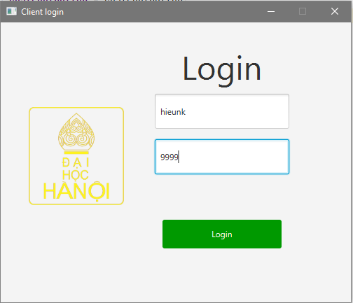
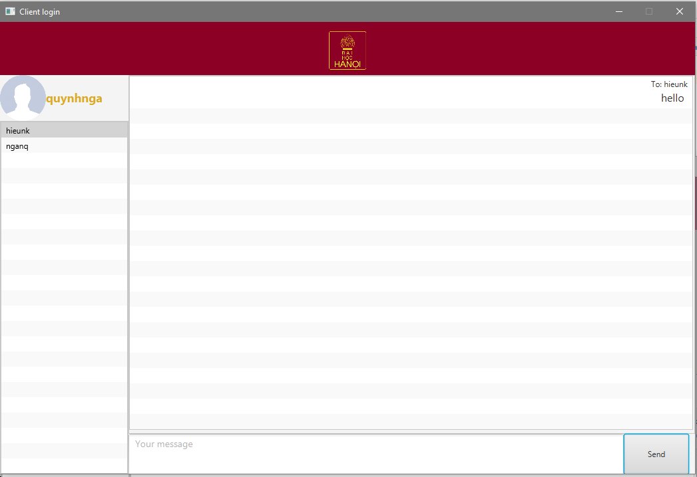
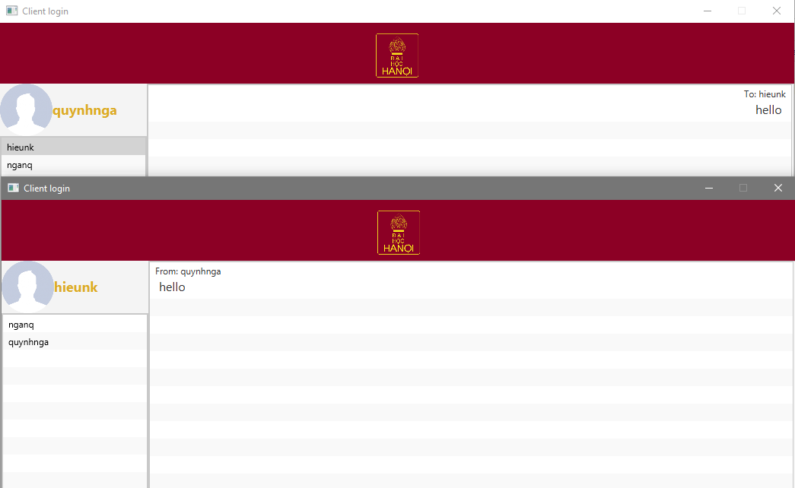

# Multiclient-chat-application
## Decription
This chat application allow user to assign an username for identity, and join the server to chatting with others.
## Usage
1. Run server first and enter the port for listening request from user
2. Run login form, enter the username and port. This port have to match the port using by server
3. Choose client active in the left pane, send message to that person
## Screenshots
1. Server view 
 
2. Login view 
 
3. Chat view 
 
 
##Exception
